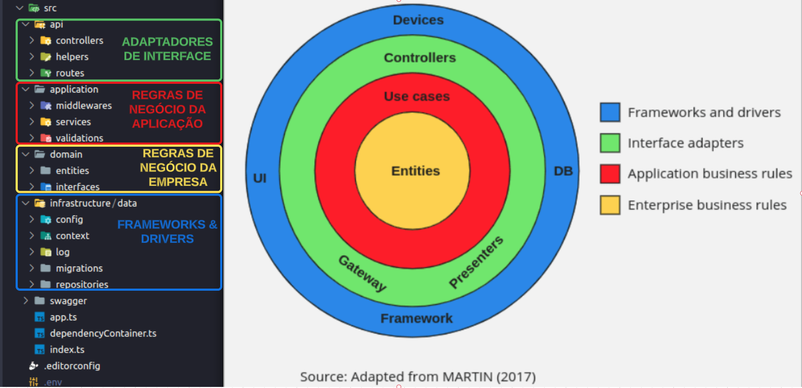
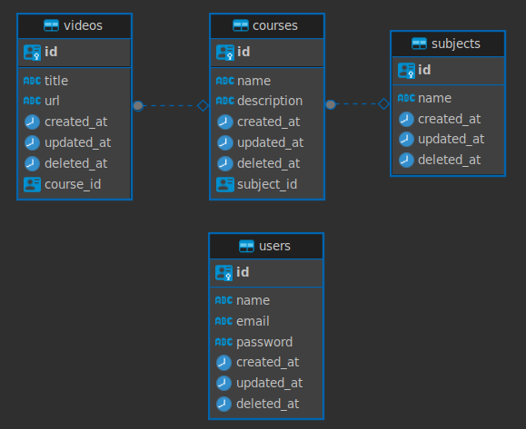

# API REST TYPESCRIPT

* [Descrição do projeto](#descrição-do-projeto)
* [Tecnologias](#tecnologias)
* [Arquitetura](#arquitetura)
* [Design Patterns](#design-patterns)
* [Regras de Negócio](#regras-de-negócio)
* [Banco de dados](#banco-de-dados)
* [Pré requisitos para rodar localmente](#pré-requisitos-para-rodar-localmente)
* [Como executar a aplicação](#como-executar-a-aplicação)
* [Documentação via swagger](#documentação-via-swagger)

### DESCRIÇÃO DO PROJETO

Projeto criado para comprovação de conhecimento em desenvolvimento **backend** na tecnologia Nodejs com Typescript.

O projeto consiste em uma API REST com as seguintes funcionalidades:

* Operações CRUD em cima de um domínio referente a cursos, videos e conteúdos como regra de negocio;
* Autenticação via JWT;
* Verificação de refresh token com Redis;
* Cache com Redis;
* Disparo de notificações via fila (RabbitMQ);

### TECNOLOGIAS

* NodeJS
* Typescript
* docker
* docker-compose
* Redis
* RabbitMQ
* PostgresSQL
* Swagger

### ARQUITETURA

#### Clean Architecture:



* **Adptadores de interface:** Contém os apresentadores, visualizações, controladores e adaptadores que convertem os dados no formato que é mais conveniente para os casos de uso e entidades ou para o formato mais conveniente para algum agente externo (por exemplo a web).

* **Regras de Negócio da Aplicação:** Reúne e implementa todos os casos de uso do sistema, onde estes orquestram o fluxo de dados para e a partir das entidades e orientam essas entidades na aplicação das Regras Cruciais de Negócios a fim de atingir os objetivos do caso de uso.

* **Regras de Negócio da Empresa:** As entidades reúnem as Regras Cruciais de Negócios da empresa inteira, podem ser um objeto contendo métodos ou um conjunto de estrutura de dados e funções. Mas o mais importante é que as entidades possam ser usadas por muitas aplicações diferentes na empresa.

* **Frameworks & Drivers:** A camada mais externa da figura acima, é geralmente composta de frameworks e ferramentas como a base de dados, framework web, logs, etc. 

### DESIGN PATTERNS

* Aplicado em cima dos conceitos de SOLID;
* Depencecy Injection via interfaces através do **package ts-ringe**;

### REGRAS DE NEGÓCIO
* Idéia principal: API para cadastro de cursos vinculados a videos e assuntos;

* Cadastro de cursos (courses)
    * Cada curso precisa estar vinculado a um assuntos (subjects);
    * Cada curso precisa estar vinculado a zero ou mais videos;
* Cadastro de videos
  * Cada video precisa estar vinculado a um curso;
* Cadastro de assuntos (subjects)
* Cada assunto precisa estar vinculado a zero ou mais cursos;
* 
### Banco de dados
  Para o projeto foi escolhido o banco PostgresSQL, onde a sua manipulação será por meio do ORM TypeORM.
  Foi escolhido o padrão Data Mapper para manipulação das entidades, esse padrão permite a consulta em classes separadas chamadas "repositórios" e salva, remove e carrega objetos usando repositórios.
  
#### ENTIDADE RELACIONAMENTO


### PRÉ REQUISITOS PARA RODAR LOCALMENTE

Ter instalado em seu computador docker e docker compose.

### COMO EXECUTAR A APLICAÇÃO

Faça o clone do projeto:
```bash
git clone https://github.com/filipeassuncao/api-rest-typescript.git
```
Copie o arquivo .env.example para o .env
```bash
cp .env.example .env
```
Preencha as variaveis que necessitam de valores;

Execute o comando:
```bash
docker-compose up --build
```

Pronto!

### DOCUMENTAÇÃO VIA SWAGGER

http://localhost:3000/api-docs/

continua...